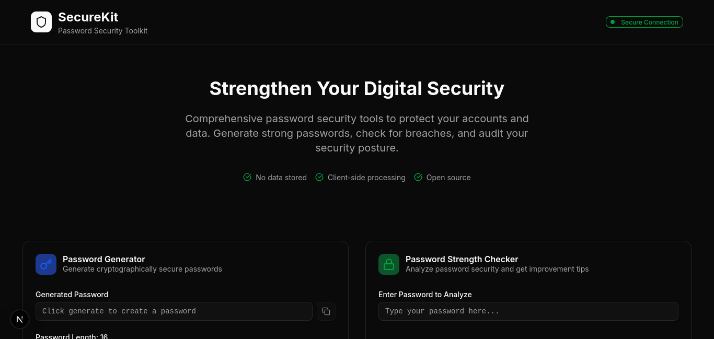

# SecureKit - Password Security Tips

This simple application provides essential tools to help users create and maintain strong passwords, check for potential security risks, and assess their overall digital security posture.


## 📸 Live Preview

<p align="center">
  
</p>

## Features

### 🔐 Password Generator
- Generate cryptographically secure passwords
- Customizable length (8-128 characters)
- Options for uppercase, lowercase, numbers, and symbols
- One-click copy to clipboard
- Real-time strength assessment

### 🛡️ Password Strength Checker
- Advanced password analysis algorithm
- Real-time strength scoring (0-100)
- Detailed feedback on password weaknesses
- Suggestions for improvement
- Visual strength indicator

### 🔍 Data Breach Checker
- Check if passwords have been compromised in known data breaches
- Simulated breach database for demonstration
- Privacy-focused - passwords are hashed locally
- Instant results with security recommendations

### ✅ Security Audit Checklist
- Interactive 15-point security assessment
- Categories: Account Security, Device Security, Network Security
- Progress tracking with completion percentage
- Best practice recommendations
- Exportable results

## Technologies Used

- **Next.js 14** - React framework with App Router
- **TypeScript** - Type-safe development
- **Tailwind CSS** - Utility-first styling
- **shadcn/ui** - Modern UI components
- **Lucide React** - Beautiful icons
- **Web Crypto API** - Secure random number generation

## Getting Started

### Prerequisites
- Node.js 18+
- npm or yarn

### Installation

1. Clone the repository:
```bash
git clone <repository-url>
cd cybersecurity-app
```

2. Install dependencies:
```bash
npm install
# or
yarn install
```

3. Run the development server:
```bash
npm run dev
# or
yarn dev
```

4. Open [http://localhost:3000](http://localhost:3000) in your browser.

## Project Structure

```
├── app/
│   ├── layout.tsx          # Root layout with fonts and providers
│   ├── page.tsx            # Main dashboard page
│   └── globals.css         # Global styles and Tailwind config
├── components/
│   ├── password-generator.tsx      # Password generation tool
│   ├── password-strength-checker.tsx  # Password analysis tool
│   ├── data-breach-checker.tsx     # Breach checking tool
│   └── security-audit.tsx          # Security audit checklist
└── README.md
```

## Security Features

- **Client-side only**: All processing happens in your browser
- **No data storage**: Passwords and personal data are never stored
- **Cryptographically secure**: Uses Web Crypto API for random generation
- **Privacy-focused**: No analytics or tracking
- **Hash-based checking**: Passwords are hashed before breach checking

## Security Tips

1. **Password Generator**: Use maximum length and all character types for strongest passwords
2. **Strength Checker**: Aim for scores above 80 for critical accounts
3. **Breach Checker**: Check all your existing passwords regularly
4. **Security Audit**: Complete the full checklist and revisit monthly

## Contributing

1. Fork the repository
2. Create a feature branch (`git checkout -b feature/amazing-feature`)
3. Commit your changes (`git commit -m 'Add amazing feature'`)
4. Push to the branch (`git push origin feature/amazing-feature`)
5. Open a Pull Request

## License

This project is licensed under the MIT License - see the LICENSE file for details.

## Disclaimer

This tool is for educational and personal use. While it follows security best practices, always use additional security measures and consult cybersecurity professionals for enterprise applications.

## Support

If you encounter any issues or have suggestions, please open an issue on GitHub.

---

Built with ❤️ for better cybersecurity practices
